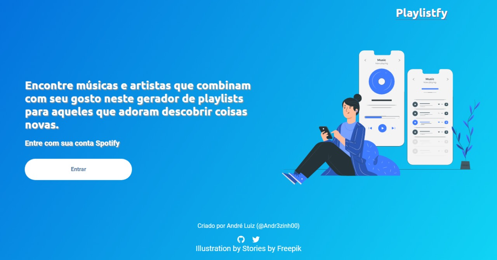
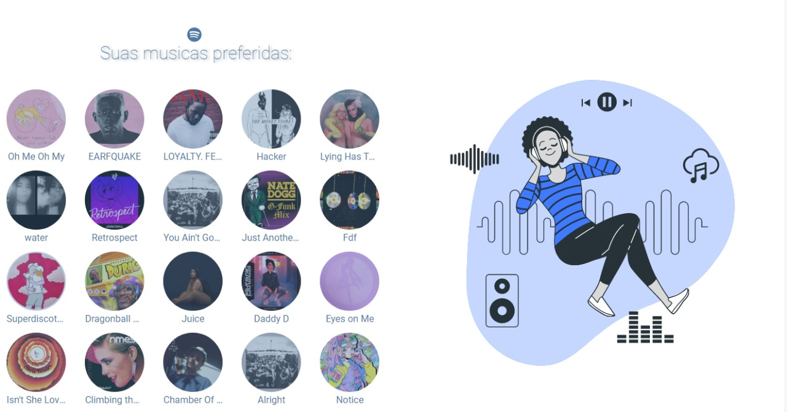
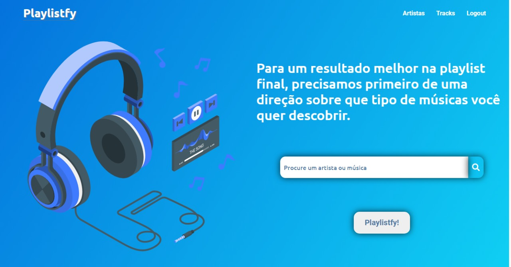
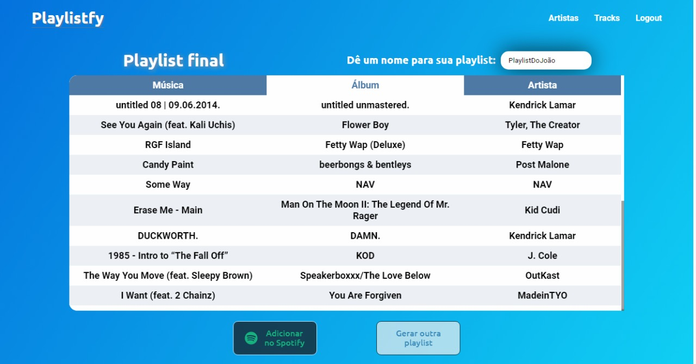
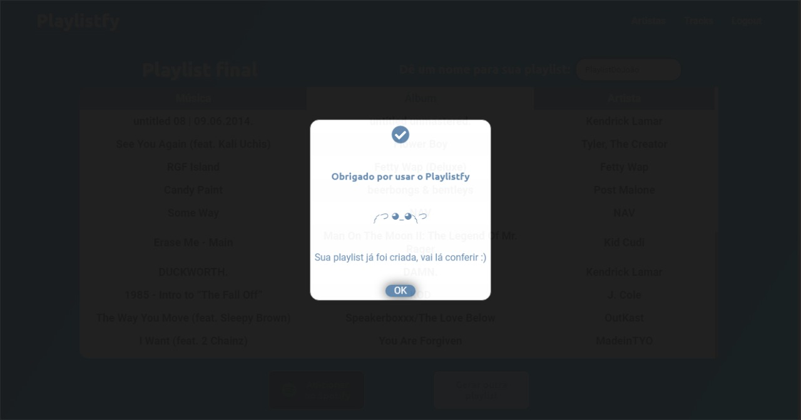
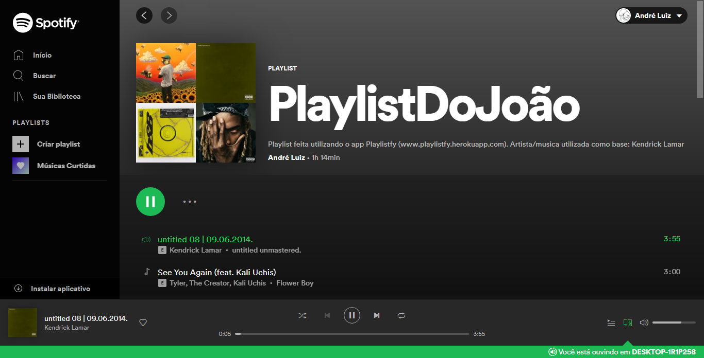

<h1>Playlistfy</h1>

<h3>Descrição do Projeto</h3>
<p>Este projeto é um criador de playlists para o Spotify, através de uma música ou artista escolhida pelo usuário o Playlistfy irá gerar uma playlist com cerca de 20 musicas.</p>

<h3>Imagens</h3>
<div style="display:grid; grid-template-columns: auto auto auto; grid-gap: 10px;">







</div>
<h4>Após isso, no aplicativo do spotify:</h4>


<h3>Principais Tecnologias</h3>
<ul>
<li></li>
<li></li>
<li></li>
</ul>

<h3>Setup</h3>
Para rodar este projeto localmente:

```sh
$ cd ../backend
$ npm install
$ npm run dev
```

```sh
$ cd ../frontend
$ npm install
$ npm start
```

<h1>Aviso:</h1>
Para rodar localmente, são necessarias as chaves de desenvolvedor do Spotify. Caso já tenha as chaves basta criar um arquivo  
.env no diretorio
/backend 
e neste arquivo criar 4 variáveis de ambiente:

```sh
CLIENT_ID=SUA_CHAVE_CLIENT_ID
CLIENT_SECRET=SUA_CHAVE_CLIENT_SECRET
CRP=QUALQUER FRASE
CRR=QUALQUER FRASE
```
